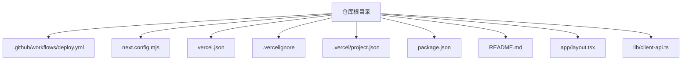
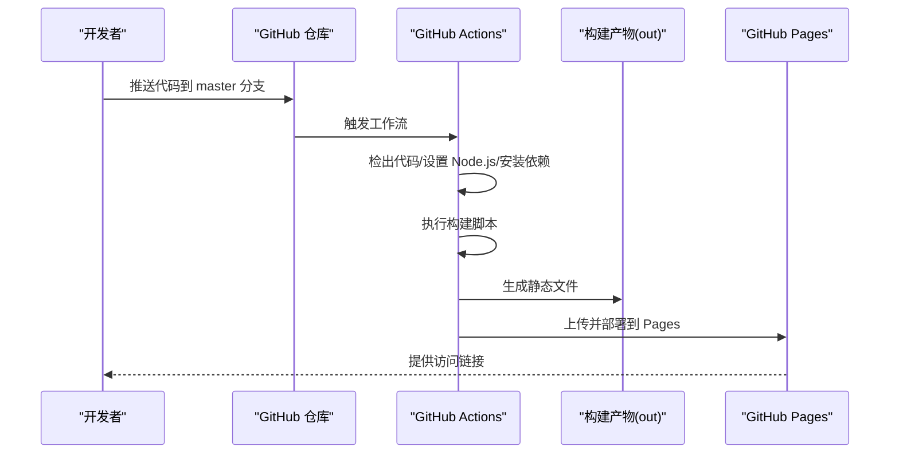
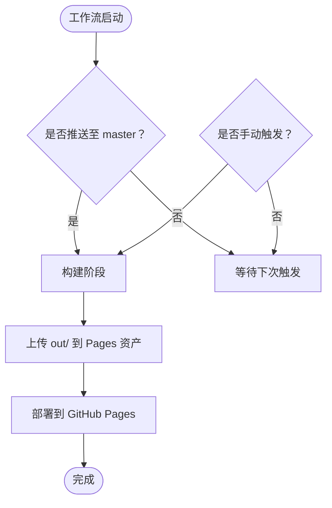
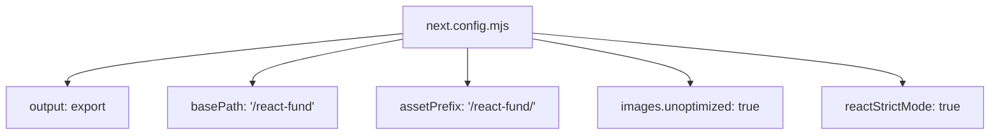
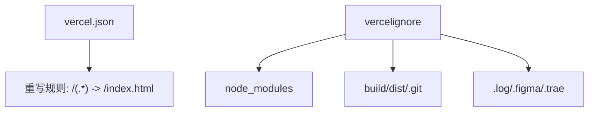
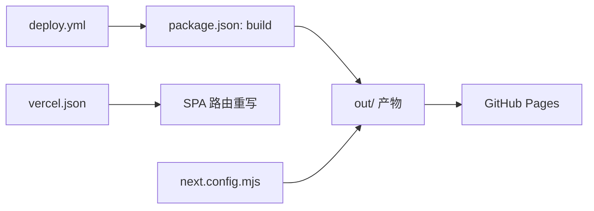

# 部署与CI/CD

<cite>
**本文引用的文件**
- [deploy.yml](file://.github/workflows/deploy.yml)
- [next.config.mjs](file://next.config.mjs)
- [vercel.json](file://vercel.json)
- [.vercelignore](file://.vercelignore)
- [.vercel/project.json](file://.vercel/project.json)
- [package.json](file://package.json)
- [README.md](file://README.md)
- [app/layout.tsx](file://app/layout.tsx)
- [lib/client-api.ts](file://lib/client-api.ts)
</cite>

## 目录
1. [简介](#简介)
2. [项目结构](#项目结构)
3. [核心组件](#核心组件)
4. [架构总览](#架构总览)
5. [详细组件分析](#详细组件分析)
6. [依赖关系分析](#依赖关系分析)
7. [性能考量](#性能考量)
8. [故障排除指南](#故障排除指南)
9. [结论](#结论)
10. [附录](#附录)

## 简介
本文件面向DevOps工程师与运维人员，系统性梳理“基金实盘跟踪”项目的部署与CI/CD实践，覆盖以下要点：
- GitHub Pages 自动部署的配置与触发机制（GitHub Actions 工作流）
- Next.js 静态导出的配置项与产物路径
- Vercel 部署的配置与优势
- 从代码提交到生产上线的完整流程
- 环境变量与敏感信息管理
- 常见问题诊断与排障
- 版本管理与回滚策略

## 项目结构
该项目采用 Next.js App Router 结构，核心部署相关文件集中在根目录与 .github/workflows 下：
- GitHub Actions 工作流：用于自动化构建与部署至 GitHub Pages
- Next.js 配置：启用静态导出与子路径前缀
- Vercel 配置：重写规则以支持 SPA 单页应用路由
- 忽略清单：控制构建与部署时的排除项

图表来源
- [deploy.yml:1-42](file://.github/workflows/deploy.yml#L1-L42)
- [next.config.mjs:1-13](file://next.config.mjs#L1-L13)
- [vercel.json:1-1](file://vercel.json#L1-L1)
- [.vercelignore:1-7](file://.vercelignore#L1-L7)
- [.vercel/project.json:1-1](file://.vercel/project.json#L1-L1)
- [package.json:1-31](file://package.json#L1-L31)
- [README.md:113-130](file://README.md#L113-L130)
- [app/layout.tsx:1-35](file://app/layout.tsx#L1-L35)
- [lib/client-api.ts:1-596](file://lib/client-api.ts#L1-L596)

章节来源
- [README.md:113-130](file://README.md#L113-L130)
- [package.json:1-31](file://package.json#L1-L31)

## 核心组件
- GitHub Actions 工作流：监听 master 分支推送与手动触发，执行 Node.js 环境准备、依赖安装、构建、产物上传与 Pages 部署
- Next.js 静态导出配置：开启 export 输出模式，设置 basePath 与 assetPrefix，禁用图片优化以适配静态托管
- Vercel 配置：通过重写规则将所有路由指向 index.html，实现 SPA 路由兼容
- 构建脚本：使用 package.json 中的 build 脚本生成静态产物 out/
- 忽略清单：.vercelignore 控制部署时忽略的目录与文件

章节来源
- [deploy.yml:1-42](file://.github/workflows/deploy.yml#L1-L42)
- [next.config.mjs:1-13](file://next.config.mjs#L1-L13)
- [vercel.json:1-1](file://vercel.json#L1-L1)
- [.vercelignore:1-7](file://.vercelignore#L1-L7)
- [package.json:5-10](file://package.json#L5-L10)

## 架构总览
下图展示从代码提交到静态站点上线的关键环节与角色：

图表来源
- [deploy.yml:3-41](file://.github/workflows/deploy.yml#L3-L41)
- [package.json:7](file://package.json#L7)
- [README.md:115-128](file://README.md#L115-L128)

## 详细组件分析

### GitHub Actions 工作流（deploy.yml）
- 触发条件：master 分支推送与手动触发
- 权限：读取内容、写 Pages、签发 ID Token
- 并发控制：按 pages 组并发，允许保留未完成任务
- 步骤分解：
  - 检出代码
  - 安装 Node.js 20 并启用 npm 缓存
  - 安装依赖
  - 执行构建脚本
  - 创建 .nojekyll 文件以禁用 Jekyll 渲染
  - 上传构建产物 out/ 为 Pages 资产
  - 部署 Pages 并记录访问 URL

图表来源
- [deploy.yml:3-41](file://.github/workflows/deploy.yml#L3-L41)

章节来源
- [deploy.yml:1-42](file://.github/workflows/deploy.yml#L1-L42)
- [README.md:115-122](file://README.md#L115-L122)

### Next.js 静态导出配置（next.config.mjs）
- 输出模式：export（静态导出）
- 子路径：basePath 与 assetPrefix 均设置为 /react-fund，适配 GitHub Pages 子路径部署
- 图片优化：unoptimized 为 true，避免动态优化带来的复杂度
- 严格模式：reactStrictMode 保持开发期严格检查

图表来源
- [next.config.mjs:2-10](file://next.config.mjs#L2-L10)

章节来源
- [next.config.mjs:1-13](file://next.config.mjs#L1-L13)
- [README.md:101](file://README.md#L101)

### Vercel 部署配置（vercel.json 与 .vercelignore）
- 重写规则：将所有源路径重写到 /index.html，确保 SPA 路由在静态托管上可用
- 忽略清单：排除 node_modules、构建产物、版本控制目录等，减少上传体积
- 项目标识：.vercel/project.json 记录项目名，便于平台识别

图表来源
- [vercel.json:1](file://vercel.json#L1)
- [.vercelignore:1-7](file://.vercelignore#L1-L7)
- [.vercel/project.json:1](file://.vercel/project.json#L1)

章节来源
- [vercel.json:1-1](file://vercel.json#L1-L1)
- [.vercelignore:1-7](file://.vercelignore#L1-L7)
- [.vercel/project.json:1-1](file://.vercel/project.json#L1-L1)

### 构建与脚本（package.json）
- scripts：包含 dev、build、start、lint 等常用命令
- 依赖：Next.js、React、Tailwind CSS、TypeScript 等生态库

章节来源
- [package.json:5-29](file://package.json#L5-L29)

### 应用入口与元数据（app/layout.tsx）
- 根布局：设置站点元数据、字体、主题脚本与根 HTML 结构
- 水合处理：通过脚本在客户端恢复主题偏好，避免首屏闪烁

章节来源
- [app/layout.tsx:1-35](file://app/layout.tsx#L1-L35)

### 数据获取与外部接口（lib/client-api.ts）
- JSONP 请求：通过动态 script 标签调用第三方金融数据接口
- 超时与清理：统一的超时与错误清理逻辑，避免内存泄漏
- 多数据源：指数、股票、基金净值与历史回报等

章节来源
- [lib/client-api.ts:1-596](file://lib/client-api.ts#L1-L596)

## 依赖关系分析
- 工作流依赖：GitHub Actions 依赖于仓库中的构建脚本与 Next.js 配置
- 构建产物：构建脚本生成 out/ 目录，作为 Pages 的发布资产
- 路由兼容：Vercel 的重写规则保证 SPA 路由在静态托管上的可用性
- 环境隔离：Next.js 对客户端可见的环境变量有前缀限制，需通过 NEXT_PUBLIC_ 暴露

图表来源
- [deploy.yml:26-31](file://.github/workflows/deploy.yml#L26-L31)
- [package.json:7](file://package.json#L7)
- [vercel.json:1](file://vercel.json#L1)
- [next.config.mjs:4-6](file://next.config.mjs#L4-L6)

章节来源
- [deploy.yml:17-41](file://.github/workflows/deploy.yml#L17-L41)
- [package.json:5-10](file://package.json#L5-L10)
- [vercel.json:1-1](file://vercel.json#L1-L1)
- [next.config.mjs:1-13](file://next.config.mjs#L1-L13)

## 性能考量
- 静态导出优势：无服务端依赖，部署简单，加载速度快
- 子路径部署：通过 basePath/assetPrefix 适配子路径，避免资源 404
- 图片优化关闭：在静态托管场景下避免额外处理开销
- 构建缓存：Actions 使用 npm 缓存提升安装速度
- 产物体积：配合 .vercelignore 控制上传大小，缩短部署时间

## 故障排除指南
- Pages 无法访问或 404
  - 检查 basePath 与 assetPrefix 是否与 Pages 设置一致
  - 确认 out/ 目录包含 .nojekyll
  - 参考：[deploy.yml:28-31](file://.github/workflows/deploy.yml#L28-L31)，[next.config.mjs:5-6](file://next.config.mjs#L5-L6)
- 子路径访问空白页或路由异常
  - 在 Vercel 或静态托管处启用 SPA 重写规则
  - 参考：[vercel.json:1](file://vercel.json#L1)
- 构建失败或依赖安装超时
  - 确认 Actions 使用 Node.js 20 且启用了 npm 缓存
  - 参考：[deploy.yml:22-26](file://.github/workflows/deploy.yml#L22-L26)
- 开发环境与生产环境差异
  - 确保仅通过 NEXT_PUBLIC_ 暴露客户端可见的环境变量
  - 参考：Next.js 文档对环境变量的说明（在本仓库中未直接出现 .env 文件）

章节来源
- [deploy.yml:22-31](file://.github/workflows/deploy.yml#L22-L31)
- [next.config.mjs:5-6](file://next.config.mjs#L5-L6)
- [vercel.json:1-1](file://vercel.json#L1-L1)

## 结论
本项目采用“Next.js 静态导出 + GitHub Pages 自动部署”的轻量级方案，结合 Vercel 的重写规则实现 SPA 路由兼容。通过明确的配置与工作流，实现了从代码提交到线上发布的自动化闭环。对于需要更高可用性与边缘加速的场景，可考虑将静态产物迁移至 Vercel 或其他 CDN 托管平台。

## 附录

### 部署流程步骤（从提交到上线）
- 推送代码至 master 分支或手动触发工作流
- Actions 拉取代码、安装依赖、执行构建脚本
- 生成 out/ 目录并上传为 Pages 资产
- 部署 Pages 并获得访问链接

章节来源
- [deploy.yml:3-41](file://.github/workflows/deploy.yml#L3-L41)
- [README.md:115-128](file://README.md#L115-L128)

### 环境变量与敏感信息管理
- 客户端可见变量：需以 NEXT_PUBLIC_ 前缀暴露
- 服务端变量：直接使用 process.env（不会进入客户端包）
- 本仓库未包含 .env 文件，建议在 CI/CD 平台的安全密钥处配置敏感变量

章节来源
- [lib/client-api.ts:105-112](file://lib/client-api.ts#L105-L112)

### 版本管理与回滚策略
- Git 分支：以 master 为主发布分支，变更通过 Pull Request 合并
- 回滚方式：可基于 Git 提交进行回滚；若 Pages 支持，也可通过平台回滚到指定工作流运行产物
- 发布节奏：建议固定周期发布，配合语义化版本与变更日志

章节来源
- [README.md:115-122](file://README.md#L115-L122)