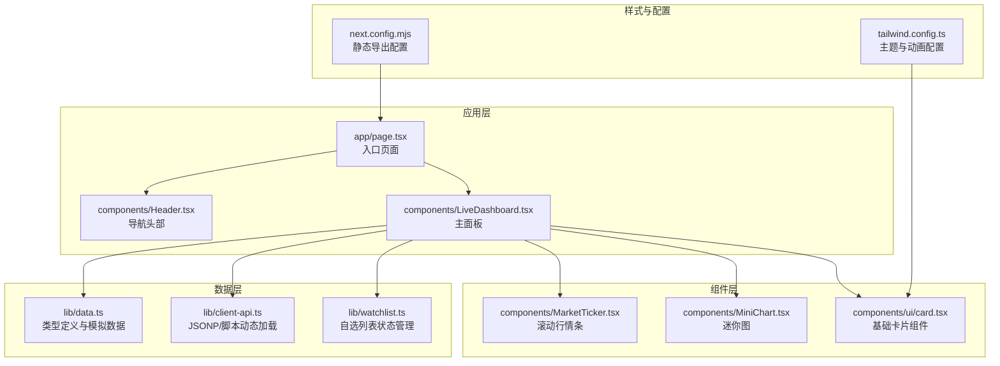
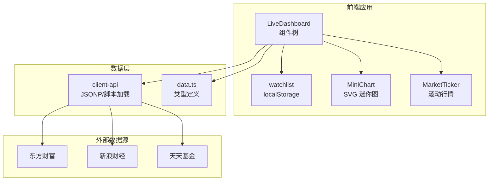
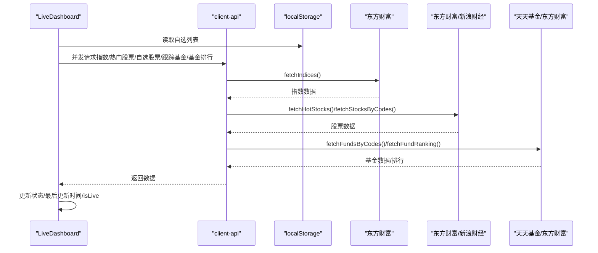
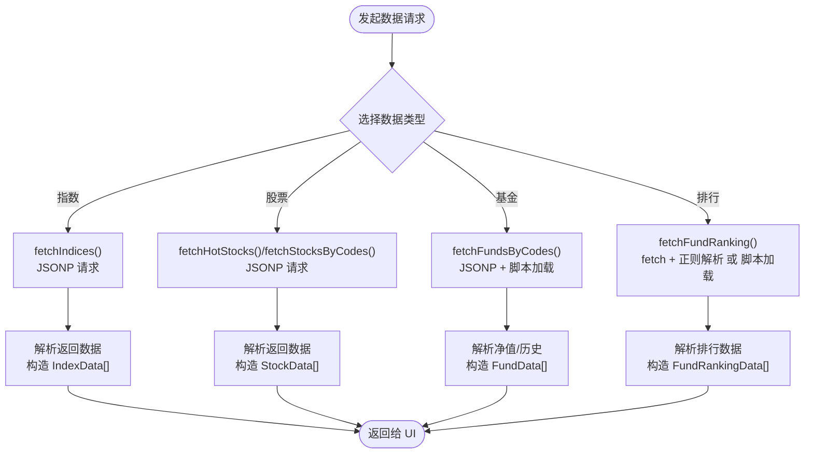
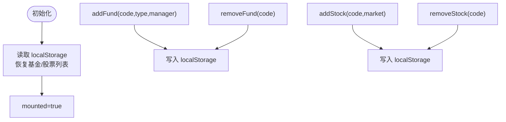
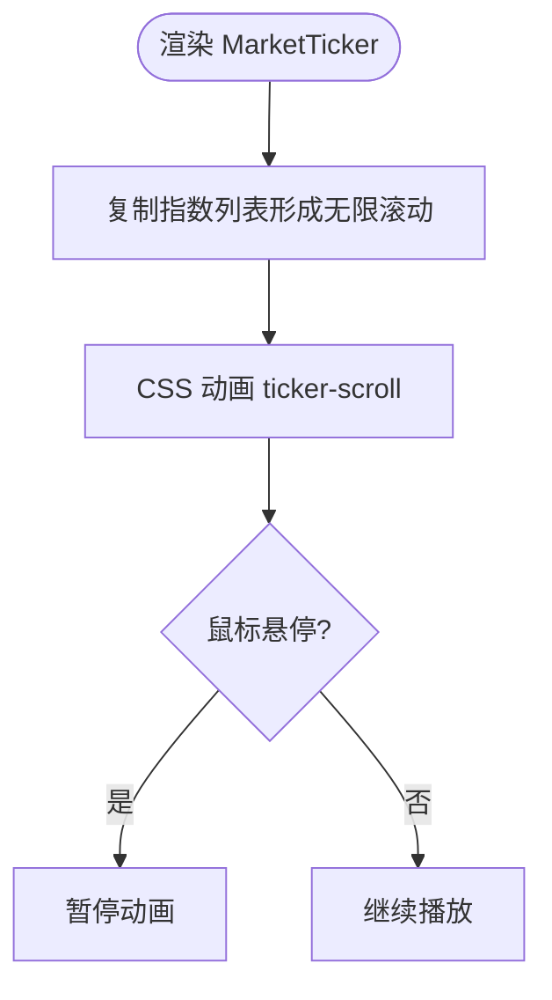
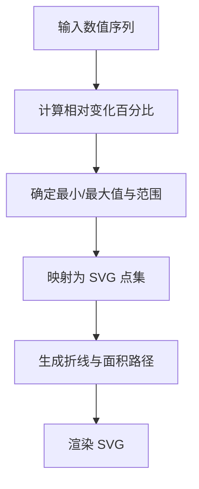
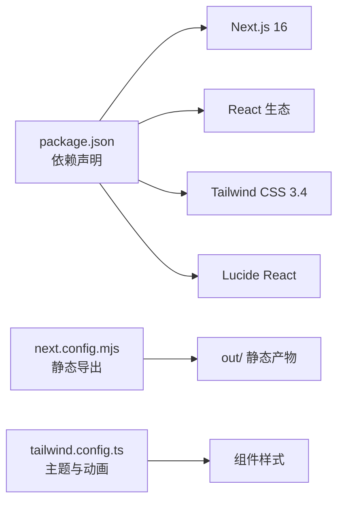

# 项目概述

<cite>
**本文档引用的文件**
- [README.md](file://README.md)
- [package.json](file://package.json)
- [app/page.tsx](file://app/page.tsx)
- [lib/data.ts](file://lib/data.ts)
- [lib/client-api.ts](file://lib/client-api.ts)
- [lib/watchlist.ts](file://lib/watchlist.ts)
- [components/LiveDashboard.tsx](file://components/LiveDashboard.tsx)
- [components/Header.tsx](file://components/Header.tsx)
- [components/MarketTicker.tsx](file://components/MarketTicker.tsx)
- [components/MiniChart.tsx](file://components/MiniChart.tsx)
- [components/ui/card.tsx](file://components/ui/card.tsx)
- [next.config.mjs](file://next.config.mjs)
- [tailwind.config.ts](file://tailwind.config.ts)
</cite>

## 目录
1. [引言](#引言)
2. [项目结构](#项目结构)
3. [核心组件](#核心组件)
4. [架构总览](#架构总览)
5. [详细组件分析](#详细组件分析)
6. [依赖关系分析](#依赖关系分析)
7. [性能考量](#性能考量)
8. [故障排查指南](#故障排查指南)
9. [结论](#结论)
10. [附录](#附录)

## 引言
本项目是一个实时金融数据面板应用，专注于全球指数、股票和基金净值的跟踪。它采用纯前端架构，无需后端服务，支持静态部署，适合个人投资者、量化爱好者以及希望构建轻量级金融看板的开发者使用。项目提供深色/浅色主题、自动刷新、自选列表管理、响应式设计等用户体验特性，并通过多个权威数据源实时获取市场数据。

## 项目结构
项目采用基于功能模块的组织方式，核心目录与职责如下：
- app：Next.js 应用入口与根布局
- components：可复用 UI 组件与业务组件
- lib：数据模型、客户端 API、状态管理与工具函数
- 样式与主题：Tailwind CSS 配置与设计系统变量
- 构建与部署：Next.js 静态导出配置与 GitHub Actions 自动部署

**图表来源**
- [app/page.tsx:10-23](file://app/page.tsx#L10-L23)
- [components/LiveDashboard.tsx:39-301](file://components/LiveDashboard.tsx#L39-L301)
- [lib/data.ts:1-255](file://lib/data.ts#L1-L255)
- [lib/client-api.ts:1-596](file://lib/client-api.ts#L1-L596)
- [lib/watchlist.ts:28-88](file://lib/watchlist.ts#L28-L88)
- [tailwind.config.ts:1-105](file://tailwind.config.ts#L1-L105)
- [next.config.mjs:1-13](file://next.config.mjs#L1-L13)

**章节来源**
- [README.md:132-161](file://README.md#L132-L161)
- [package.json:1-31](file://package.json#L1-L31)

## 核心组件
- 实时主面板（LiveDashboard）：负责聚合全球指数、热门股票、自选股票、跟踪基金、基金排行等数据，实现每 30 秒自动刷新与手动刷新。
- 数据源客户端（client-api）：封装 JSONP 与动态脚本加载，统一处理东方财富、天天基金、新浪财经等数据接口。
- 自选列表状态（watchlist）：基于 localStorage 的用户自选管理，支持基金与股票的增删操作。
- 滚动行情条（MarketTicker）：顶部实时滚动显示全球指数行情，支持鼠标悬停暂停。
- 迷你图（MiniChart）：基于 SVG 的简洁趋势图，用于展示指数/基金的历史走势片段。
- 基础卡片组件（ui/card）：遵循设计系统，提供卡片容器与内容区域的基础样式。

**章节来源**
- [components/LiveDashboard.tsx:39-301](file://components/LiveDashboard.tsx#L39-L301)
- [lib/client-api.ts:1-596](file://lib/client-api.ts#L1-L596)
- [lib/watchlist.ts:28-88](file://lib/watchlist.ts#L28-L88)
- [components/MarketTicker.tsx:8-51](file://components/MarketTicker.tsx#L8-L51)
- [components/MiniChart.tsx:9-56](file://components/MiniChart.tsx#L9-L56)
- [components/ui/card.tsx:4-78](file://components/ui/card.tsx#L4-L78)

## 架构总览
项目采用纯前端架构，数据通过 JSONP 与动态脚本从多个金融数据源拉取，状态通过 React Hooks 与 localStorage 管理，最终由 Next.js 静态导出为可部署的静态站点。

**图表来源**
- [components/LiveDashboard.tsx:39-301](file://components/LiveDashboard.tsx#L39-L301)
- [lib/client-api.ts:1-596](file://lib/client-api.ts#L1-L596)
- [lib/data.ts:1-255](file://lib/data.ts#L1-L255)
- [lib/watchlist.ts:28-88](file://lib/watchlist.ts#L28-L88)
- [components/MiniChart.tsx:9-56](file://components/MiniChart.tsx#L9-L56)
- [components/MarketTicker.tsx:8-51](file://components/MarketTicker.tsx#L8-L51)

## 详细组件分析

### 实时主面板（LiveDashboard）
- 职责：聚合多源数据、控制刷新频率、管理 Tab 切换、渲染统计卡片与各板块内容。
- 关键流程：
  - 初始化时读取自选列表（localStorage），若存在则请求对应股票/基金数据；否则使用模拟数据。
  - 每 30 秒并发请求全球指数、热门股票、自选股票、跟踪基金与基金排行。
  - 根据返回结果更新状态，记录最后更新时间，标记是否为实时数据。
  - 提供手动刷新按钮与“实时/模拟”状态指示。
- 性能与错误处理：使用 Promise.allSettled 并发请求，避免单点失败阻塞整体；对异常进行捕获与日志输出；实时状态通过 isLive 字段标识。

**图表来源**
- [components/LiveDashboard.tsx:56-95](file://components/LiveDashboard.tsx#L56-L95)
- [lib/client-api.ts:154-199](file://lib/client-api.ts#L154-L199)
- [lib/client-api.ts:203-240](file://lib/client-api.ts#L203-L240)
- [lib/client-api.ts:421-458](file://lib/client-api.ts#L421-L458)
- [lib/client-api.ts:462-495](file://lib/client-api.ts#L462-L495)
- [lib/client-api.ts:527-595](file://lib/client-api.ts#L527-L595)

**章节来源**
- [components/LiveDashboard.tsx:39-301](file://components/LiveDashboard.tsx#L39-L301)

### 数据源客户端（client-api）
- JSONP 工具：封装动态脚本注入与超时清理，统一处理回调命名与错误清理。
- 指数数据：通过东方财富接口获取全球主要指数的实时行情与历史 K 线，用于迷你图展示。
- 股票数据：获取热门股票与自选股票的最新价格、涨跌、成交量与成交额。
- 基金数据：通过天天基金获取净值与日涨跌，通过东方财富获取历史收益与净值曲线片段。
- 基金排行：解析网页脚本或 JSONP 获取当日涨跌幅排行。
- 搜索接口：支持基金与股票的搜索，返回匹配结果列表。

**图表来源**
- [lib/client-api.ts:5-36](file://lib/client-api.ts#L5-L36)
- [lib/client-api.ts:154-199](file://lib/client-api.ts#L154-L199)
- [lib/client-api.ts:203-240](file://lib/client-api.ts#L203-L240)
- [lib/client-api.ts:421-495](file://lib/client-api.ts#L421-L495)
- [lib/client-api.ts:527-595](file://lib/client-api.ts#L527-L595)

**章节来源**
- [lib/client-api.ts:1-596](file://lib/client-api.ts#L1-L596)

### 自选列表状态（watchlist）
- 职责：维护用户自选的基金与股票列表，持久化到 localStorage，并提供增删操作。
- 特性：初始化时从 localStorage 恢复数据；兼容旧格式；提供默认自选基金集合；支持双向绑定到主面板。

**图表来源**
- [lib/watchlist.ts:28-88](file://lib/watchlist.ts#L28-L88)

**章节来源**
- [lib/watchlist.ts:28-88](file://lib/watchlist.ts#L28-L88)

### 滚动行情条（MarketTicker）
- 职责：顶部展示全球指数的实时行情，支持鼠标悬停暂停滚动。
- 实现：复制数组实现无缝循环滚动，根据涨跌设置颜色与箭头图标。

**图表来源**
- [components/MarketTicker.tsx:8-51](file://components/MarketTicker.tsx#L8-L51)

**章节来源**
- [components/MarketTicker.tsx:8-51](file://components/MarketTicker.tsx#L8-L51)

### 迷你图（MiniChart）
- 职责：基于 SVG 绘制简洁的趋势图，用于展示指数/基金的历史片段。
- 实现：计算相对变化百分比，归一化绘制路径与渐变填充，按涨跌设置颜色。

**图表来源**
- [components/MiniChart.tsx:9-56](file://components/MiniChart.tsx#L9-L56)

**章节来源**
- [components/MiniChart.tsx:9-56](file://components/MiniChart.tsx#L9-L56)

### 基础卡片组件（ui/card）
- 职责：提供卡片容器、标题、描述与内容区域的基础样式，配合设计系统变量实现主题切换。
- 使用：被 LiveDashboard 中的统计卡片与各板块卡片复用。

**章节来源**
- [components/ui/card.tsx:4-78](file://components/ui/card.tsx#L4-L78)

## 依赖关系分析
- 技术栈与版本：
  - 框架：Next.js 16（静态导出）
  - 语言：TypeScript 5
  - 样式：Tailwind CSS 3.4 + CSS 变量
  - 图标：Lucide React
  - 部署：GitHub Pages + GitHub Actions
- 外部依赖：react、react-dom、next、lucide-react、tailwindcss 等。
- 构建配置：静态导出、路径前缀与图片优化关闭，便于 GitHub Pages 部署。

**图表来源**
- [package.json:11-29](file://package.json#L11-L29)
- [next.config.mjs:1-13](file://next.config.mjs#L1-L13)
- [tailwind.config.ts:1-105](file://tailwind.config.ts#L1-L105)

**章节来源**
- [package.json:1-31](file://package.json#L1-L31)
- [next.config.mjs:1-13](file://next.config.mjs#L1-L13)
- [tailwind.config.ts:1-105](file://tailwind.config.ts#L1-L105)

## 性能考量
- 并发请求：使用 Promise.allSettled 并发拉取多类数据，减少总等待时间。
- 自动刷新：每 30 秒刷新一次，平衡实时性与网络开销。
- 本地存储：自选列表持久化，避免每次刷新重新请求。
- 静态导出：构建产物可直接部署至 CDN/GitHub Pages，减少服务器压力。
- 动画与渲染：滚动行情条使用 CSS 动画，迷你图采用 SVG 渲染，保证流畅度。

[本节为通用性能讨论，不直接分析具体文件]

## 故障排查指南
- 数据未更新或显示“模拟数据”
  - 检查网络请求是否成功，确认 JSONP/脚本加载是否超时。
  - 查看控制台是否有错误日志。
- 自选列表无法保存或丢失
  - 确认浏览器允许 localStorage。
  - 检查 localStorage 中是否存在对应键名。
- 部署后资源路径错误
  - 确认 basePath 与 assetPrefix 配置正确。
  - 确保静态导出产物放置在正确的子路径下。

**章节来源**
- [lib/client-api.ts:5-36](file://lib/client-api.ts#L5-L36)
- [lib/watchlist.ts:33-51](file://lib/watchlist.ts#L33-L51)
- [next.config.mjs:5-6](file://next.config.mjs#L5-L6)

## 结论
本项目以纯前端架构实现了金融数据面板的核心能力，具备实时性、易部署、低门槛的特点。通过合理的数据抽象与组件拆分，既满足初学者的学习需求，也为有经验的开发者提供了清晰的扩展路径。建议后续可考虑增加缓存策略、错误重试机制与更丰富的图表可视化选项。

[本节为总结性内容，不直接分析具体文件]

## 附录
- 适用场景与用户群体
  - 个人投资者：关注全球主要指数与自选基金/股票的实时表现。
  - 量化爱好者：作为数据采集与可视化的前端原型。
  - 开发者：学习 Next.js 静态导出、TypeScript 与 Tailwind CSS 的实践案例。
- 主要功能特性概览
  - 全球指数：9 大指数实时行情与滚动行情条
  - 股票行情：热门股票与自选股票管理
  - 基金净值：跟踪基金净值、日涨跌与历史收益
  - 用户体验：自动刷新、深色/浅色主题、响应式设计、纯静态部署

**章节来源**
- [README.md:34-63](file://README.md#L34-L63)