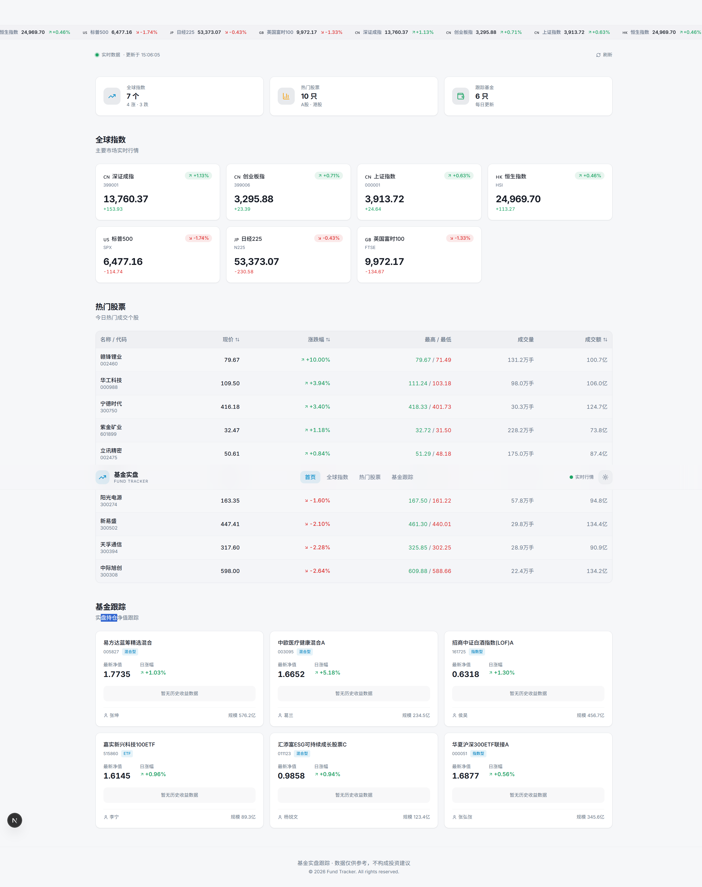
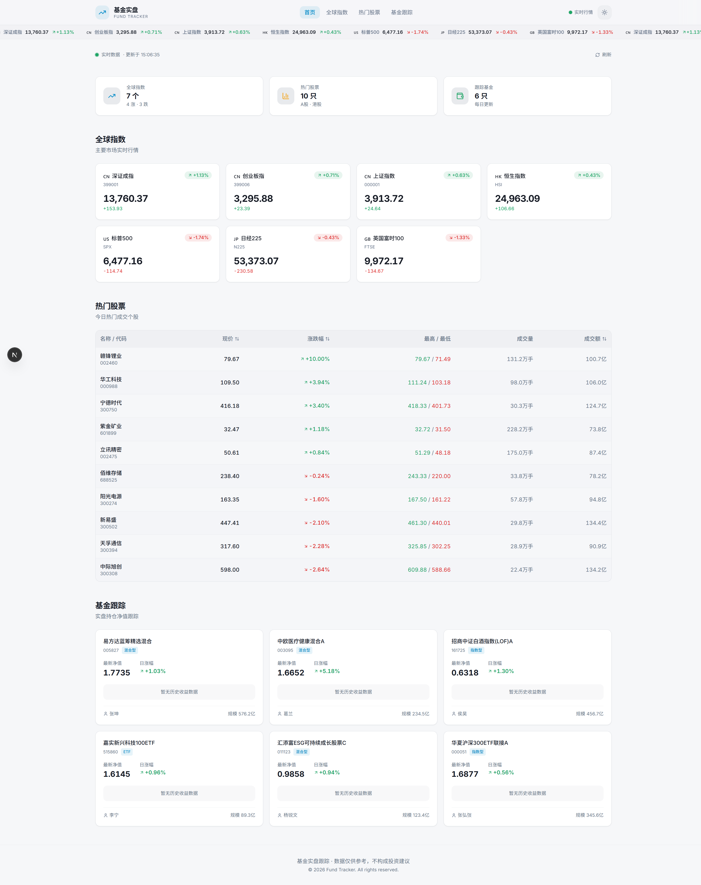

<p align="center">
  
  
  
  
  
</p>

<h1 align="center">React Fund</h1>

<p align="center">
  <strong>A real-time financial dashboard for tracking global indices, hot stocks, and fund NAV.</strong>
  <br />
  实时基金跟踪面板 — 全球指数 · 热门股票 · 基金净值
</p>

<p align="center">
  <a href="https://neveryu.github.io/react-fund/">Live Demo</a> · 
  <a href="./README.md">中文</a>
</p>

---

## Preview

### Dark Mode



### Light Mode



---

## Features

### Market Overview
- **Global Indices** — Real-time data for 9 major indices:
  - 🇨🇳 China: SSE, SZSE, ChiNext
  - 🇭🇰 Hong Kong: HSI
  - 🇺🇸 USA: NASDAQ, S&P 500
  - 🇯🇵 Japan: Nikkei 225
  - 🇬🇧 UK: FTSE 100
  - 🇰🇷 Korea: KOSPI
- **Live Ticker** — Scrolling marquee displaying all indices across the top

### Stock Tracking
- **Hot Stocks** — Top 10 A-shares ranked by turnover with price, change %, high/low, and volume
- **Custom Watchlist** — Search and add your own stocks to track
- **Tab Switching** — Toggle between "Hot Stocks" and "My Watchlist"

### Fund Tracking
- **Fund Search** — Search funds by name or code via East Money API
- **Custom Watchlist** — Build your personalized fund portfolio
- **Fund Details** — NAV, daily change, fund manager, and performance data
- **One-click Remove** — Hover to reveal remove button on any fund card

### User Experience
- **Auto Refresh** — Data refreshes every 30 seconds with manual refresh button
- **Dark / Light Theme** — Toggle with smooth animation, persisted via `localStorage`
- **Persistent Watchlist** — Your selections saved locally, survive page refresh
- **Responsive Design** — Fully responsive from mobile to desktop
- **Static Hosting** — Pure static export, no server required, deploys to GitHub Pages

---

## Tech Stack

| Category | Technology |
|----------|-----------|
| Framework | Next.js 16 (Static Export) |
| Language | TypeScript 5 |
| Styling | Tailwind CSS 3.4 + CSS Variables |
| Icons | Lucide React |
| Data Source | East Money API + Sina Finance API (JSONP) |
| Deployment | GitHub Pages + GitHub Actions |

---

## Getting Started

### Prerequisites

- Node.js >= 18
- npm >= 9

### Install & Run

```bash
# Clone the repository
git clone https://github.com/neveryu/react-fund.git
cd react-fund

# Install dependencies
npm install

# Start development server
npm run dev
```

Open [http://localhost:3000/react-fund](http://localhost:3000/react-fund) in your browser.

### Build

```bash
npm run build
```

Static files will be generated in the `out/` directory.

---

## Deployment

This project is configured for **GitHub Pages** with automated deployment via GitHub Actions.

### Setup

1. Push the code to the `main` branch of your GitHub repository.
2. Go to **Settings** > **Pages** in your repository.
3. Set **Source** to **GitHub Actions**.
4. The workflow will automatically build and deploy on every push to `main`.

Your site will be available at:

```
https://<username>.github.io/react-fund/
```

---

## Project Structure

```
react-fund/
├── app/
│   ├── globals.css          # Design system & theme variables
│   ├── layout.tsx           # Root layout with FOUC prevention
│   └── page.tsx             # Entry page
├── components/
│   ├── Header.tsx           # Navigation header
│   ├── LiveDashboard.tsx    # Main dashboard with data fetching
│   ├── MarketTicker.tsx     # Scrolling index ticker
│   ├── IndexCard.tsx        # Global index card with sparkline
│   ├── StockTable.tsx       # Hot stocks table with remove support
│   ├── FundCard.tsx         # Fund tracking card with remove button
│   ├── SearchModal.tsx      # Search modal for funds & stocks
│   ├── MiniChart.tsx        # SVG sparkline renderer
│   ├── ThemeToggle.tsx      # Dark/light mode toggle
│   └── ui/                  # Base UI components (Button, Card)
├── lib/
│   ├── client-api.ts        # JSONP-based API client (indices, stocks, funds, search)
│   ├── watchlist.ts         # Watchlist state management with localStorage
│   ├── data.ts              # Type definitions & mock data
│   └── utils.ts             # Utility functions
├── .github/workflows/
│   └── deploy.yml           # GitHub Pages deployment workflow
├── tailwind.config.ts       # Tailwind theme configuration
├── next.config.mjs          # Next.js static export config
└── package.json
```

---

## Data Source

Market data is fetched in real-time from multiple sources via JSONP:

| Data Type | Source |
|-----------|--------|
| Global Indices | East Money (push2.eastmoney.com) |
| Stock Quotes | East Money (push2.eastmoney.com) |
| Fund NAV | Tiantian Fund (fundgz.1234567.com.cn) |
| Fund History | East Money (api.fund.eastmoney.com) |
| Fund Search | East Money (fundsuggest.eastmoney.com) |
| Stock Search | Sina Finance (suggest3.sinajs.cn) |

> **Disclaimer**: Data is for reference only and does not constitute investment advice.

---

## License

MIT
