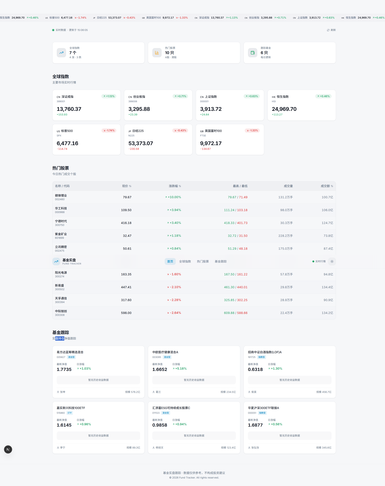
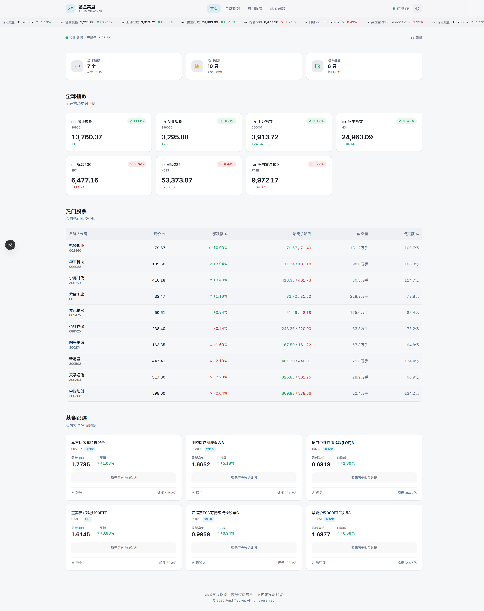

<p align="center">
  
  
  
  
  
</p>

<h1 align="center">React Fund</h1>

<p align="center">
  <strong>A real-time financial dashboard for global indices, daily market analysis, fund tracking, and sector capital flow.</strong>
  <br />
  实时基金跟踪面板 — 全球指数 · 每日播报 · 基金净值 · 板块资金
</p>

<p align="center">
  <a href="https://neveryu.github.io/react-fund/">Live Demo</a> ·
  <a href="./README.md">中文</a>
</p>

---

## Preview

### Dark Mode



### Light Mode



---

## Features

### Global Indices
- **9 Major Indices** — Real-time data for:
  - 🇨🇳 China: SSE, SZSE, ChiNext
  - 🇭🇰 Hong Kong: HSI
  - 🇺🇸 USA: NASDAQ, S&P 500
  - 🇯🇵 Japan: Nikkei 225
  - 🇬🇧 UK: FTSE 100
  - 🇰🇷 Korea: KOSPI
- **Live Ticker** — Scrolling marquee displaying all indices across the top
- **K-line Charts** — View daily/weekly/monthly candlestick charts

### Daily Market Analysis
- **Market Overview** — A-share advance/decline counts, limit up/down stats, total turnover, and visual ratio bar
- **Industry Sectors** — Top 10 industry sectors ranked by change %, with leading stocks
- **Concept Sectors** — Top 10 concept sectors ranked by change %
- **Capital Flow** — Top 10 sectors by main force net inflow
- **Sector Heatmap** — Treemap visualization of sector performance
- **Turnover Comparison** — Intraday turnover comparison chart for Shanghai/Shenzhen markets

### Stock Tracking
- **Hot Stocks** — Top 10 A-shares ranked by turnover with price, change %, high/low, and volume
- **Custom Watchlist** — Search and add your own stocks to track
- **Tab Switching** — Toggle between "Hot Stocks" and "My Watchlist"

### Fund Tracking
- **Fund Search** — Search funds by name or code via East Money API
- **Custom Watchlist** — Build your personalized fund portfolio
- **Fund Details** — NAV, daily change, fund manager, holdings, and performance data
- **Multi-period Returns** — View returns across 6 timeframes: day/week/month/3M/6M/year

### Fund Ranking
- **Market-wide Ranking** — All open-end funds ranked by daily change
- **Multi-dimensional Sorting** — Sort by day/week/month/3M/6M/year/2-year returns
- **Detail View** — Click any fund to view manager, scale, and holdings

### AI-Powered Analysis
- **Daily Summary** — Auto-generated market summary based on real-time data
- **Sentiment Analysis** — Market sentiment derived from advance/decline ratio and capital flow

### User Experience
- **Auto Refresh** — Data refreshes every 30 seconds with manual refresh button
- **Dark / Light Theme** — Toggle with smooth animation, persisted via `localStorage`
- **Persistent Watchlist** — Your selections saved locally, survive page refresh
- **Responsive Design** — Fully responsive from mobile to desktop
- **Scroll to Top** — Quick navigation button appears on scroll
- **Static Hosting** — Pure static export, no server required, deploys to GitHub Pages

---

## Tech Stack

| Category | Technology |
|----------|-----------|
| Framework | Next.js 16 (Static Export) |
| Language | TypeScript 5 |
| UI | React 19 |
| Styling | Tailwind CSS 3.4 + CSS Variables |
| Icons | Lucide React |
| Data Source | East Money API + Tiantian Fund API (JSONP) |
| Deployment | GitHub Pages + GitHub Actions |

---

## Getting Started

### Prerequisites

- Node.js >= 18
- npm >= 9

### Install & Run

```bash
# Clone the repository
git clone https://github.com/neveryu/react-fund.git
cd react-fund

# Install dependencies
npm install

# Start development server
npm run dev
```

Open [http://localhost:3000/react-fund](http://localhost:3000/react-fund) in your browser.

### Build

```bash
npm run build
```

Static files will be generated in the `out/` directory.

---

## Deployment

This project is configured for **GitHub Pages** with automated deployment via GitHub Actions.

### Setup

1. Push the code to the `master` branch of your GitHub repository.
2. Go to **Settings** > **Pages** in your repository.
3. Set **Source** to **GitHub Actions**.
4. The workflow will automatically build and deploy on every push to `master`.

Your site will be available at:

```
https://<username>.github.io/react-fund/
```

---

## Project Structure

```
react-fund/
├── app/
│   ├── globals.css              # Design system & theme variables
│   ├── layout.tsx               # Root layout with FOUC prevention
│   └── page.tsx                 # Entry page
├── components/
│   ├── Header.tsx               # Navigation header
│   ├── LiveDashboard.tsx        # Main dashboard with data fetching
│   ├── MarketTicker.tsx         # Scrolling index ticker
│   ├── IndexCard.tsx            # Global index card with sparkline
│   ├── IndexChartModal.tsx      # K-line chart modal
│   ├── DailyMarketAnalysis.tsx  # Daily market analysis container (tabs)
│   ├── MarketOverview.tsx       # Market overview (advancers/decliners/turnover)
│   ├── SectorRankingTable.tsx   # Sector ranking table (industry/concept)
│   ├── CapitalFlowTable.tsx     # Capital flow table
│   ├── SectorAnalysis.tsx       # Sector analysis summary
│   ├── SectorHeatmap.tsx        # Sector heatmap (Treemap)
│   ├── TurnoverComparison.tsx   # Turnover comparison line chart
│   ├── StockTable.tsx           # Hot stocks table with remove support
│   ├── FundCard.tsx             # Fund tracking card with remove button
│   ├── FundRankingTable.tsx     # Fund ranking table
│   ├── FundDetailModal.tsx      # Fund detail modal
│   ├── SearchModal.tsx          # Search modal for funds & stocks
│   ├── AiSettingsModal.tsx      # AI configuration modal
│   ├── MiniChart.tsx            # SVG sparkline renderer
│   ├── ScrollToTop.tsx          # Scroll to top button
│   ├── ThemeToggle.tsx          # Dark/light mode toggle
│   └── ui/                      # Base UI components (Button, Card)
├── lib/
│   ├── client-api.ts            # JSONP-based API client (indices, stocks, funds, sectors)
│   ├── ai-daily-analysis.ts     # AI daily analysis logic
│   ├── ai-config.ts             # AI configuration management
│   ├── watchlist.ts             # Watchlist state management with localStorage
│   ├── data.ts                  # Type definitions & mock data
│   └── utils.ts                 # Utility functions
├── .github/workflows/
│   └── deploy.yml               # GitHub Pages deployment workflow
├── tailwind.config.ts           # Tailwind theme configuration
├── next.config.mjs              # Next.js static export config
└── package.json
```

---

## Data Sources

Market data is fetched in real-time from multiple sources via JSONP:

| Data Type | Source |
|-----------|--------|
| Global Indices | East Money (push2.eastmoney.com) |
| Index K-line | East Money (push2his.eastmoney.com) |
| Stock Quotes | East Money (push2.eastmoney.com) |
| Stock Search | East Money (searchapi.eastmoney.com) |
| Fund NAV | Tiantian Fund (fundgz.1234567.com.cn) |
| Fund History | East Money (fund.eastmoney.com) |
| Fund Ranking | East Money (fund.eastmoney.com) |
| Fund Search | East Money (fundsuggest.eastmoney.com) |
| Fund Holdings | East Money (fundf10.eastmoney.com) |
| Sector Ranking | East Money (push2.eastmoney.com) |
| Sector Capital Flow | East Money (push2.eastmoney.com) |

> **Disclaimer**: Data is for reference only and does not constitute investment advice.

---

## License

MIT
